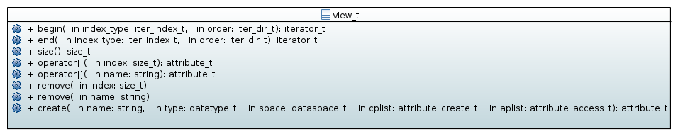

.. _attribute-namespace:

=========================================================
Attribute management (namespace :cpp:any:`h5::attribute`)
=========================================================

Each instance of :cpp:class:`node_t` can have attributes attached which 
can be used to store all kind of meta-data of a node.
The attributes of an instance of :cpp:class:`node_t` can be access via the 
public attribute :cpp:member:`attributes` which is an instance of 
:cpp:class:`attribute::view_t`. 

.. figure:: ../images/attribute_view_node_relation.png
   :align: center
   :width: 500px

:cpp:class:`attribute::view_t` provides an STL compliant container view 
on the attributes attached to a node. 

