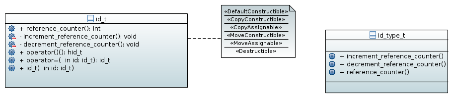
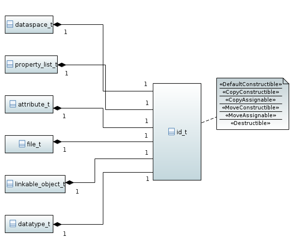

===========================
Namespace :cpp:any:`h5::id`
===========================

In the C-API of HDF5 objects are referenced by IDs which are returned by 
creation or access functions. Theses IDs are potentially dangerous. 

Possible issues

* the user forgets to close an object which prohibits the file containing 
  the object to be closed properly. 
* side effects can occur when IDs are copied without managing their reference
  counter correctly.

The C++ wrapper uses a thin guard class :cpp:class:`id_t` around such an 
ID which solves all the problems described above. 

* it manages the reference counting when an *object* is moved or copied 
* it ensures that the object gets closed once its instance looses scope.

A possible interface could look like this 

.. code-block:: cpp

   class id_t
   {
        private:
            hid_t _id;
            void increment_reference_counter();
            void decrement_reference_counter();
        public:
            // default constructor sets the ID to 0
            id_t();
            
            // copy constructor - will incremenet the reference counter
            explicit id_t(const id_t &id);
            
            //move constructor - will not increment the reference counter
            explicit id_t(id_t &&id);
            
            //ensures that we always take control
            explicit id_t(hid_t &&id);
           
            //ensures that the ID is properly destroyed when the id looses
            //scope.
            ~id_t(); 
           
            //close the ID deliberately 
            void close(); 
           
            // copy assigment - will increment the reference counter 
            id_t &operator=(const id_t &id);
            
            // move assignment - will not increment the reference counter
            id_t &operator=(id_t &&id);
           
            // get access to the plain ID via static_cast 
            explicit hid_t() const noexcept
            {
                return _id;
            }         
   }; 
   
The fact that the user defined conversion operator is defined as *explicit* 
requires us to use :cpp:any:`static_cast` to obtain the ID. 

.. code-block:: cpp

    id_t id(H5Tcopy(H5T_NATIVE_DOUBLE));
    
    //now we want to use the ID
    H5Dcreate(......,static_cast<hid_t>(id),....);
    
    
This should make it sufficiently difficult to access the unguarded ID an do 
anything harmful with it.

Construction of an ID
=====================

Constructing an ID from an plain :cpp:type:`hid_t` value could be done 
this way

.. code-block:: cpp

    id_t id(H5Tcopy(H5T_NATIVE_DOUBLE));
    
or if we want to some error checking in advance

.. code-block:: cpp

    hid_t id_plain = H5Tcopy(H5T_NATIVE_DOUBLE);
    
    if(id_plain < 0)
    {
        //do some error management here 
    }
    
    id_t id(std::move(id_plain));
    
There is some design question we need to solve

.. todo::

    To which should the move constructor of :cpp:class:`id_t` perform 
    error checking?
    
Copying and moving
==================

As mentioned earlier, the main purpose of :cpp:class:`id_t` is to manage
reference counting and the lifetime of an ID. 
Whether or not the reference counter is incremented depends on how an 
ID is copied or constructed. 

For the construction we get

.. code-block:: cpp

    id_t id = ....; //create an initial id 
    
    id_t id1(id); //will increment the reference count on the ID
    id_t id2(std::move(id)); //does not increment the reference count 
   
For assignment we get 

.. code-block:: cpp 

    id_t id = ...; //create an initial id 
    
    id_t id2,id3;
    
    id2 = id;   //copy assignment - will increment the reference counter
    id3 = std::move(id); //move assigment - will not increment the reference
                         //counter