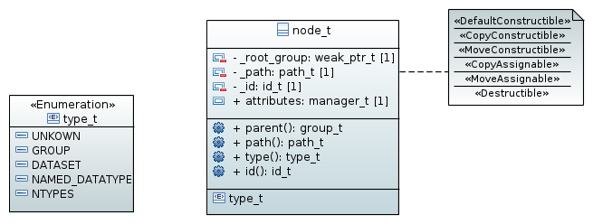
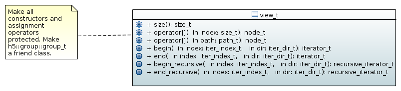

=====================================
Nodes (namespace :cpp:any:`h5::node`)
=====================================

:cpp:class:`node_t` serves two purposes 

* it provides methods and data common to all nodes of the HDF5 tree
* it serves as a return value for all group iterators. This is necessary as we
  do not know whether a particular child of a group is another group, a dataset
  , or a named data type.
  

As nodes are the only objects which can hold attributes :cpp:class:`node_t` 
also stores the public :cpp:member:`attributes` attribute which is an 
instance of :cpp:class:`attribute::manager_t` (see :ref:`attribute-namespace` 
for more information about attribute management).

:cpp:class:`node_t` provides only minimum functionality. To do something 
reasonable we have to cast it to one of it child classes

.. figure:: ../images/node_types.png
   :align: center
   :width: 500px
   
Details about the child classes can be found  

* for :cpp:class:`named_datatype_t` in :ref:`named-datatype`
* for :cpp:class:`dataset_t` in :ref:`dataset-namespace`
* for :cpp:class:`group_t` in :ref:`group-namespace`

However, it is possible to determine the type of an instance of 
:cpp:class:`node_t` by calling its :cpp:func:`type` method which returns 
an enumeration of type :cpp:enum:`node_t::type_t`. This enumeration 
defines the following values

+--------------------------------------------------+----------------------+
| enumerator                                       | node type            |
+==================================================+======================+
| :cpp:enumerator:`node_t::type_t::GROUP`          | if the instance is a |
|                                                  | group                |
+--------------------------------------------------+----------------------+
| :cpp:enumerator:`node_t::type_t::DATASET`        | if the instance is a |
|                                                  | dataset              |
+--------------------------------------------------+----------------------+
| :cpp:enumerator:`node_t::type_t::NAMED_DATATYPE` | if the instance is a |
|                                                  | named datatype       |
+--------------------------------------------------+----------------------+

The :cpp:func:`parent` and :cpp:func:`path` member function return an 
instance of the parent group and the path to the object. For details about 
this two member functions see :ref:`the-name-problem`.

.. _node-iterators:

Iterators
=========

The namespace :cpp:any:`h5::node` provides two iterators 

* :cpp:class:`h5::node::iterator_t`
* and :cpp:class:`h5::node::recursive_iterator_t` 

which can be used to iterate over the nodes attached to a group. The 
former one iterates only over the direct children of a group while the latter
one iterates recursively over all children and subchildren of a group. 

.. figure:: ../images/node_iterators_uml.png
   :align: center
   :width: 500px

Both iterators satisfy the *ForwardIterator* concept as defined by the 
C++ standard (see `ForwardIterator concept`_ for details).
The iterators can be created using the free standing functions

.. code-block:: cpp

    namespace h5 {
    namespace node {
        
        iterator_t begin(const h5::group::group_t &group,
                         h5::utilities::iter_index_t &index,
                         h5::utilities::iter_dir_t &direction);
        iterator_t end(const h5::gruop::group_t &group);
        
        recursive_iterator_t begin_recursive(const h5::group::group_t &group,
                                             h5::utilities::iter_index_t &index,
                                             h5::utilities::iter_dir_t &direction);
        recursive_iterator_t end_recursive(const h5::group::group_t &group);
    
    }   // end of namespace node
    }   // end of namespace h5

.. _ForwardIterator concept: http://en.cppreference.com/w/cpp/concept/ForwardIterator

View
====

An instance of :cpp:class:`group_t` can be interpreted in three ways

* as a container of attributes
* as a container of other nodes (datasets, groups and name datatypes)
* and as a container of links

Access to theses different representations is given by view types. 
:cpp:class:`h5::node::view_t` provides an STL container compliant view 
on the child-nodes of a group

