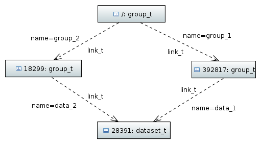
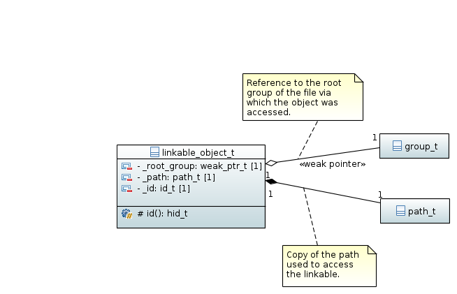
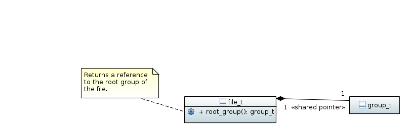

================
The name problem
================

The objects in an HDF5 file are organized as a directed graph consisting of 
*nodes* connected by *edges*. The *edges* are represented by *links* which 
are in terms of this wrapper library instances of :cpp:class:`link_t`. 

Currently three types of *nodes* exist in HDF5

* *groups* from which new links can branch of and which are represented by 
  instances of :cpp:class:`group_t`
* *datasets* which store data and are leaf-like nodes (the cannot have 
  child nodes)
* and *named datatypes* which are the second group of leaf-like nodes. 

The corresponding C++ classes for the latter two are :cpp:class:`dataset_t` and 
:cpp:class:`named_datatype_t`. 

.. figure:: ../images/links_and_linkables.png
   :align: center
   :width: 75%
  
When a new file is created the only node existing in the file is the root 
group with the special name `/`. Groups can be considered as containers for 
instances of :cpp:class:`link_t` which can be addressed by a unique name 
and point towards oder node objects stored in the file. It follows from this
that the name of an object is not associated with the object itself but rather
with the link pointing towards it. 

Consider now the following structure 

.. figure:: ../images/hdf5_tree.png
   :align: center
   :width: 60%

The numbers in the instance specifications refer to the addresses of the objects
within the file. We can imagine now that every links resolves a *name* to 
an address of an object. Every object can thus be addressed by a path 
which consists of the names of the links used to dereference an object. 
In the above example we have two datasets which can be accessed with 
the two paths 

* `/group_1/data_3` and 
* `/group_2/data_2`. 

Unfortunately one can also create such a structure

In this example we have suddenly two paths which lead to the same dataset 
object in the file

* ``/group_1/data_1`` or 
* ``/group_2/data_2``.

The fact, that the path to an object is not necessarily unique causes several 
problems 

#. we cannot ask an object for its parent object as it can have multiple 
   parents 
#. the same is true for the path leading to an object: there is not necessarily 
   only a single path. As the reference  manual for :c:func:`H5Iget_name`
   states: the returned name can be one of many possible. Which one is not
   determined
#. if we iterate over the groups of an HDF5 file, looking for instance for all
   datasets within the file, it is quite possible that we retrieve several 
   references pointing to the same object in the file. As the object can 
   be accessed by several routes the path (name) of an object is not sufficient
   to check for object equality and thus identify multiple instances 
   in such a recursive iteration.
   
Unfortunately all of theses issues are consequences of the principle design 
(using a directed graph) and thus no simple solution exists.

Pragmatic solution
==================

To summarize the above conclusion 

* the path to an object is not necessarily unique
* there is currently no means to check two objects for equality (at least 
  within a file).

In particular the first problem has its origins in the basic design principles 
there  is no unique solution to it. Thus, in this section, we will 
look for a pragmatic solution. 

Obtaining an objects name and parent
------------------------------------

The first question which needs answering is what the expected behavior would be.
What does a user expect when asking for the *parent* or the *name* of an object?
The simple answer might be

* as for the *name* of an object one would expect to obtain the path which 
  was used to access the object in the first place
* and for the *parent* we can assume pretty much the same as one would expect
  to retrieve the group which was originally used to access the object.

Let's clarify this with the above diamond-example. When the dataset is accessed
via ``group_2`` we expect its name to be ``/group_2/data_2`` and an instance of
``group_2`` as its parent group.

The simplest way to achieve this goal is to store the path used to access
an object along with every instance of the object. It is then easy to 
access the parent object by means of the root group (from which we know is 
always there) and, well, the correct name is already provided by the path. 

The root group is referenced by a weak pointer which ensures that an 
instance of :cpp:class:`linkable_object_t` is default constructible. 

A file instance could hold a reference to the root group within a 
shared pointer which can later be used to initialize the weak pointer.

Checking for object equality
----------------------------

This problem is more difficult to solve. We could consider two objects as equal
if they refer to the same object within the HDF5 file. For obvious reasons the
path to an object is not a suitable measure to check for equality.

The key is here to find an identifier associated with each object which 
determines the object uniquely within the file. One possible candidate for 
this would be the :c:member:`H5O_info_t::addr` field stored in the 
:c:type:`H5O_info_t` struct.

.. warning:: 

    Can the address of an object change once it has been writen to disk? 