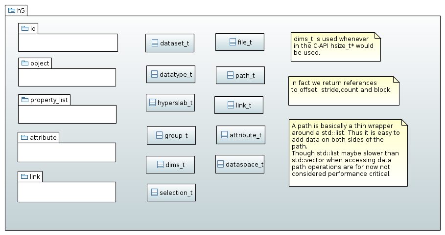

===============
The big picture
===============

The HDF5 tree
=============

HDF5 organizes data within a file as a directed graph consisting of *nodes* 
connected via *links*. We can roughly distinguish between to types of nodes: 
those who can contain other nodes and those who can not. We will refer to the 
former ones as *group* nodes and to the latter ones as *leaf nodes*. 

.. figure:: images/hdf5_tree.png
   :align: center
   :width: 700

Technically all node types are descendants of :cpp:class:`node_t` 

.. figure:: images/node_types.png
   :align: center
   :width: 500px
   
There are currently two types of leaf nodes: :cpp:class:`dataset_t` and 
:cpp:class:`named_datatype_t` and one group type :cpp:class:`group_t`. 
 
The links between the nodes are represented by instances of :cpp:class:`link_t`.  
We can distinguish between three types of links described by the enueration 
type :cpp:enum:`link::type_t`.

+----------------------------------------------+------------------------------+
| link type                                    | description                  |
+==============================================+==============================+
| :cpp:enumerator:`h5::link::type_t::HARD`     | typically the first link     |
|                                              | created when an object is    |
|                                              | created in the file. Every   |
|                                              | object must have a least one |
|                                              | hard link pointing to it.    |
+----------------------------------------------+------------------------------+
| :cpp:enumerator:`h5::link::type_t::SOFT`     | Comparable to a symbolic     |
|                                              | link on a file systems.      |
|                                              | Removing this link does not  |
|                                              | remove an object or makeing  |
|                                              | it inaccessible.             |
+----------------------------------------------+------------------------------+
| :cpp:enumerator:`h5::link::type_t::EXTERNAL` | References an object in a    |
|                                              | different file.              |
+----------------------------------------------+------------------------------+

Aside from *nodes* and *links* there are some more auxiliary types available 
which help to construct the tree and feed data into it. 

* :cpp:class:`id_t` - wraps an HDF5 :cpp:type:`hid_t` ID used to handle 
  objects within the library
* :cpp:class:`datatype_t` - represents an HDF5 data type. Used for IO and 
  attribute and dataset creation
* :cpp:class:`property_list_t` and its descendants are used to parametrized 
  all kinds of functions in the HDF5 C-API
* :cpp:class:`dataspace_t` - describes the rank and the number of elements 
  along each dimension of data in file or memory
* :cpp:class:`file_t` - provides access to file related functions.

There are some more types available which are not mentioned here but these 
are the most prominent ones.

 

The library namespaces
======================

   
All objects reside in the toplevel namespace :cpp:any:`h5`. There are some
subnamespaces which contain special functions and classes usually not required
for normal operations. 

The following namespaces are available

+------------------------------+----------------------------------------+-+
| namespace                    | description                            | |
+==============================+========================================+=+
| :cpp:any:`h5`                | the top-level namespace of the library | |
+------------------------------+----------------------------------------+-+
| :cpp:any:`h5::id`            | classes and functions dealing with ID  | |
|                              | management                             | |
+------------------------------+----------------------------------------+-+
| :cpp:any:`h5::error`         | package providing error management     | |
|                              | related functions and classes.         | |
+------------------------------+----------------------------------------+-+
| :cpp:any:`h5::property_list` | property list classes and related      | |
|                              | functions                              | |
+------------------------------+----------------------------------------+-+
| :cpp:any:`h5::attribute`     | attribute related classes and          | |
|                              | functions                              | |
+------------------------------+----------------------------------------+-+
| :cpp:any:`h5::link`          | classes and functions related to links | |
+------------------------------+----------------------------------------+-+
| :cpp:any:`h5::dataspace`     | classes and functions related to       | |
|                              | HDF5 data spaces                       | |
+------------------------------+----------------------------------------+-+
| :cpp:any:`h5::utilities`     | namespace with general utilty types,   | |
|                              | and functions used throughout the      | |
|                              | the library                            | |
+------------------------------+----------------------------------------+-+
| :cpp:any:`h5::datatype`      | datatype related classes and functions | |
+------------------------------+----------------------------------------+-+
| :cpp:any:`h5::dataset`       | dataset related classes and functions  | |
+------------------------------+----------------------------------------+-+
| :cpp:any:`h5::file`          | file related classes and functions     | |
+------------------------------+----------------------------------------+-+
| :cpp:any:`h5::group`         | group related classes and functions    | |
+------------------------------+----------------------------------------+-+
| :cpp:any:`h5::node`          | classes and functions for general      | |
|                              | node management                        | |
+------------------------------+----------------------------------------+-+

The namespaces mimic in some way the organization of HDF5's C-API. 
For the sake of simplicity some of the types are made available to the 
top-level namespace :cpp:any:`h5` via aliases. 

.. code-block:: cpp

    namespace h5 {
        
        using path_t      = utilities::path_t;
        using datatype_t  = datatype::datatype_t;
        using dataspace_t = dataspace::dataspace_t;
        using hyperslab_t = dataspace::dataspace_t; 
        using dataset_t   = dataset::dataset_t;
        using file_t      = file::file_t;
        using attribute_t = attribute::attribute_t;
        using linkt_t     = link::link_t;
        using node_t      = node::node_t;
        using group_t     = group::group_t;
    
    } // end of namespace h5
    
Iterators
=========

One of the general design goals is to provide an interface as close as possible 
to the STL. This would allow users, for instance, to select objects from 
an HDF5 tree according to a predefined predicate. 
Though HDF5 provides iterator/visitor functions for nodes, links, and 
attributes, the concept behind this functions is quite different from the 
standard iterator concept in C++. While C++ basically distinguishes between 
forward and reverse iterators, HDF5 provides far more flexibility.

HDF5 not only provides the concept of forward and reverse iteration but also 
allows a *fastest* iteration direction which is determined by the C-API. Thus 
the concept of forward and reverse iteration does not make sense at all. 
In addition HDF5 allows the user to select the key by which the sequence 
of objects is sorted: this can be either done lexicographically by the name
of an object or by the order in which the child-objects of a parent have been 
created. *h5++* accounts for this additional degree of freedom by providing
two utility types :cpp:enum:`iter_index_t` and :cpp:enum:`iter_dir_t` (see 
:ref:`iterator-utilities` for details).

Last but not least HDF5 allows for *direct* and *recursive* iteration. In the 
former case the iterator runs only over the direct children of a parent while
in the latter case all subgroups are covered too.

Iterators in C++ are instantiated typically by two functions :cpp:func:`begin` 
and :cpp:func:`end` which come in two flavors:

* as member functions of a container class

    .. code-block:: cpp
    
        class container
        {
            public:
                using iterator = ...;
                
                iterator begin();
                iterator end(); 
        };
        
* or as free standing functions

    .. code-block:: cpp
    
        class container 
        {
            .....
        };
        
        container::iterator begin(container &c);
        container::iterator end(container &c);
        
For HDF5 these functions need some extensions concerning their argument list
as they must take the additional degrees of freedom into account. In addition 
we have to distinguish between recursive and direct iteration

* for the member functions we get now  

    .. code-block:: cpp
    
        class container
        {
            public:
                // iterator for direct iteration
                using iterator = ...;
                // iterator for recursive iteration
                using recursive_iterator = ...
                
                iterator begin(iter_index_t index,
                               iter_dir_t dir);
                iterator end(iter_index_t index,
                             iter_dir_t dir); 
                recursive_iterator begin_recursive(iter_index_t index,
                                         iter_dir_t dir);
                recursive_iterator end_recursive(iter_index_t index,
                                                 iter_dir_t dir);
                          
        };
        
* and the signatures of the free standing functions would alter to 

    .. code-block:: cpp
    
        class container 
        {
            .....
        };
        
        container::iterator begin(container &c,
                                  iter_index_t index,
                                  iter_dir_t dir);
        container::iterator end(container &c,
                                iter_index_t index,
                                iter_dir_t dir);
        container::recursive_iterator begin_recursive(container &c,
                                                      iter_index_t index,
                                                      iter_dir_t dir);
        container::recursive_iterator end_recursive(container &c,
                                                    iter_index_t index,
                                                    iter_dir_t dir);        
 
We can mabye omit the :cpp:func:`begin_recursive` and 
:cpp:func:`end_recursive` by adding a tag-type to the signature of 
:cpp:func:`begin` and :cpp:func:`end` to distinguish between direct and 
recursive iteration. However, in any case, this additional information must 
be conveyed in some or the other way.

As a matter for fact this is not a real complication for most of the STL 
algorithms which required the *begin* and *end* iterator to be passed 
explicitly. However, this is a problem for range based algorithms and 
statements like the *range-for* loop. 

.. note::

    There is currently no good solution for this as long as we want to keep 
    the flexiblity of the HDF5 iterators.
