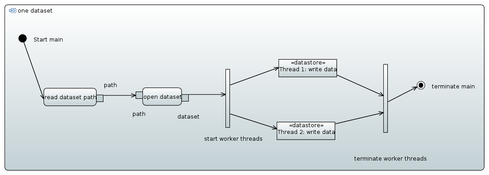

=============
Thread safety
=============

Problem description
===================

The current C-API provides a simple locking mechanism when compiled with 
the thread-safety option active. There exists a single library wide lock 
comparable to the global interpreter lock of the Python interpreter. 

.. note::

    Is it possible to provide a more elaborate locking scheme on a per object
    level?

Aside from all the complications that come along when implementing thread 
safe interfaces there is one major obstacle which needs to be resolved 
before we can continue with this topic. 

    How to deal with different threads accessing the same object by means
    of independent instances of their representation. 
    
Consider here the default situations.

  
The main thread opens the dataset and passes a reference to the dataset two 
its two worker threads. In this case, standard locking mechanisms should be 
sufficient to protect the system from race conditions.

However, in the next example a slightly different appraoch was taken. 
   
.. figure:: images/threads_two_datasets.png
   :align: center
   :width: 75%
   
Here, each threads opens its dataset independently and thus acts on an 
independent instance of :cpp:class:`dataset_t`. Unfortunately, both instances 
act on the same dataset in the file which should immediately introduce race
conditions as mutexes do not work on this level.

Possible solutions
==================

Questions that need answering 

* for which classes we need thread safe interfaces and/or implementations?
* which use cases do we have for thread safety (is there a real benefit 
  or do we want to have this just for convenience so that existing thread 
  safe programs do not need a redesign)?
* is it possible to implement thread safety without slowing down the library
  for single threaded applications (if we cannot, would it be better to 
  implement adapters which provide thread safe interfaces for the non-thread
  safe default interfaces)? This is particularly important as for many 
  applications the bottle neck is the performance of the IO device and in this 
  case haveing multiple threads to write data would not help. 
  What about reading?
* if thread-safety is not possible or far to expensive to implement, what 
  strategies do we have to provide to deal for multi-threaded applications?
* What are the limitations of the underlying C-API? Is there anyting 
  special we have to care about? 

  
Some thoughts about interfaces
------------------------------

A particular problem with thread-safety is not only setting the mutexes 
correctly (which is rather mechanically) but also the design of the entire
interface to an object.