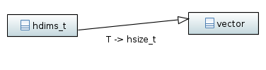
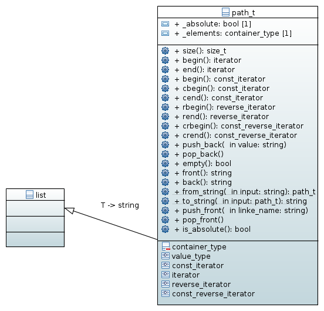

=============
Utility types
=============

This chapter describes utility types introduced by this C++ wrapper which 
should make working with the interface easier. 

Describing dimensions
=====================

A common problem when writing C-code using the C-API of HDF5 is the necessity 
to use raw pointers when creating hyperslabs or when describing the number 
of elements along the dimensions of a data space. This is particularly 
tedious when the number of dimensions is known only at runtime and we thus
have to do memory allocation 

.. code-block:: c

    hsize_t *current_dims = NULL;
    hsize_t *max_dims = NULL;
    int ndims = 0;
    hid_t space_id = 0;
    
    ndims = get_number_of_dimensions();
    
    current_dims = (hsize_t*)malloc(ndims*sizeof(hsize_t));
    if(current_dims==NULL)
    {
        /* do some error management here */
    }
    
    max_dims = (hsize_t*)malloc(ndims*sizeof(hsize_t));
    if(max_dims == NULL)
    {
        /* do some more error management here */
    }
    
    get_current_dimensions(current_dims);
    get_maximum_dimensions(max_dims);
    
    /* finally we can create the dataspace here */
    if((space_id = H5Screate_simple(ndims,current_dims,max_dims))<0)
    {
        /* do some more error management here */
    }
    
    
    /* finally  we have to free all the memory again *
    if(current_dims!=NULL) free(current_dims);
    
    if(max_dims!=NULL) free(max_dims);
    
Already with all the error management omitted this is already quite some 
code just to create a dataspace whose number of dimensions is only known at 
runtime. 

We thus define the utility type :cpp:type:`hdims_t` with 

.. code-block:: cpp

    using hdims_t = std::vector<hsize_t>;
    

    
The above code than reads

.. code-block:: cpp

    hdims_t max_dims, current_dims;
    hid_t space_id = 0;
    
    max_dims = get_maximum_dims();
    current_dims = get_current_dims();
    
    space_id = H5Screate_simple(current_dims.size(),
                                current_dims.data(),
                                max_dims.data());
    if(space_id<0)
    {
        // do some error handling here
    }
    
As memory management is done by :cpp:class:`std::vector` we do not have 
to care about this any more. 
    
.. _utility-types-index-range:
    
Index ranges
============

A crucial part when constructing selections (hyperslabs) is to specify index
ranges (Python calls this a slice). 

.. code-block:: cpp

    //
    // alternatively we could call this slice_t
    //
    class index_range_t
    {
        public:
            explicit index_range_t(hsize_t first,hsize_t last,hsize_t stride=1);
            index_range_t(hsize_t last);

            hsize_t first_index() const;
            hsize_t last_index() const;
            hsize_t stride() const;
    };

As usual for C style languages the last index is not included in the range. 
So 

.. code-block:: cpp

    index_range_t range(0,10);

Would denote the range from 0 to 9.

Referencing objects within a file :cpp:class:`path_t`
=====================================================

Traditionally the HDF5 library uses strings to denote the name or path 
of an object. This has two major disadvantages 

* as for objects on the file system a string has no particular semantics 
* paths encoded as strings are particularly hard to manipulate. 

To circumvent these issues a new type :cpp:class:`path_t` is introduced. 
It is basically a thin wrapper around :cpp:class:`std::list`.

    
Path construction
=================

Typically a path will be constructed from a string 

.. code-block:: cpp

    path_t p("/run_091/sensors/temperature/data");
    
    
    
Construction from a pair of iterators should also be supported 

.. code-block:: cpp

    path_t p("/run_091/sensors/temperature/data");
    
    path_t base_path(p.begin(),--p.end());
    
For obvious reaons such an interator constructor would be implemented as  a
template

.. code-block:: cpp

    class path_t
    {
        public:
            template<typename IterT> paht_t(IterT first,IterT last);
    };
    
String conversion
=================

In many cases it would be necessary to convert an instance of :cpp:class:`path_t`
back to its string representation. We definitely should support stream IO by 
overloading the operators

.. code-block:: cpp

    std::ostream &operator<<(std::ostream &stream, const path_t &path);
    std::istream &operator>>(std::istream &stream, path_t &path);

One application here would be for instance :cpp:any:`boost::program_options` 
which uses theses operators to read command line options. Providing these 
operators would make it possible to directly use :cpp:class:`path_t` as a 
valid option type.

For all other purposes we should provide two static member functions 

.. code-block:: cpp

    class path_t
    {
        public:
        
            static std::string to_string(const path_t &path);
            static path_t from_string(const std::string &string);
    };
    
Implicit conversion by a conversion constructor and operator is discouraged 
as it can lead to strange side-effects. 

Some non-member functions
=========================

    