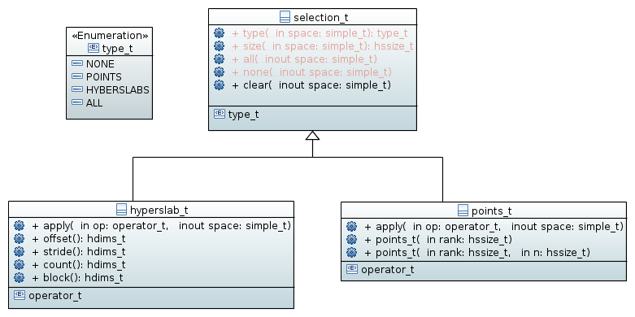

.. _namespace-dataspace:

=============================================
Datspace (namespace :cpp:any:`h5::dataspace`)
=============================================

Different kinds of dataspaces
=============================

HDF5 supports three kinds of dataspaces

* a *scalar* dataspace which can hold exactly one item
* a *null* dataspace which has no data at all
* and a *simple* dataspace which represents a multidimensional array

.. figure:: ../images/dataspace_types.png
   :align: center
   :width: 600px

The :cpp:func:`h5::dataspace::create` also exists as a function template
creating memory dataspaces for C++ container types

.. code-block:: cpp

    std::vector<double> temperature(1023);

    auto space = dataspace::create(temperature);

*h5cpp* supports the templates :cpp:class:`std::vector` and
:cpp:class:`std::array`. However, user defined container types can be
added by providing an appropriate specialization of the
:cpp:class:`container_trait` template

.. code-block:: cpp

    template<typename T> class my_container
    {
    };

    namespace h5 {
    namespace dataspace {

        template<typename T> struct container_trait<my_container<T>>
        {
            using container_type = my_container<T>;

            // obtain the rank of the container
            static hsize_t rank(const container_type &c);

            // obtain the current dimensions of the container
            static hdims_t current_dims(const container_type &c);

            // obtain the maximum dimensions of the container
            static hdims_t maximum_dims(const container_type &c);

            // create an instance of the container from a dataspace
            static my_container<T> create(const simple_t &space);
        };
    }
    }

Different kinds of selections
=============================

.. note::

    Working with selections is considered a performance critical aspect.
    Thus, every design approach should focus on performance.

HDF5 supports two kinds of selections

* *hyperslab* selections
* and *points* selections

Hyperslab selectins
-------------------

Point selections
----------------

Point selections can be easily constructed from initializer lists

.. code-block:: cpp

    dataspace::point_t points{{1,3,4},{4,5,5},{4,3,4}};

Or via a call to its :cpp:func:`push_back` member function.

.. code-block:: cpp

    dataspace::point_t points(3);

    points.push_back({1,2,3});
    points.push_back({4,5,5});
    points.push_back({4,3,4});

Changing the values of coordinates

.. code-block:: cpp

    dataspace::points_t points(3,9);

    // by index
    points[0][0] = 5;
    points[0][1] = 1;
    points[0][2] = 3;

    // with an initializer list

    points[1] = {5,10,23};

Iteration would be nice

.. code-block:: cpp

    dataspace::points_t points(4,20); //5 points in a 4 dimensional dataset

    // move a set of points along a single dimension of a dataset
    for(auto &coordinate: points)
    {
        coordinate[0] += 1;
    }

Using a point selection

.. code-block:: cpp

    dataspace::simple_t space = dset.dataspace();  //get dataspace from a dataset

    dataspace::points_t points{{3,2,3},{4,5,5}};

    points.apply(dataspace::point_t::operator_t::Set,space);
