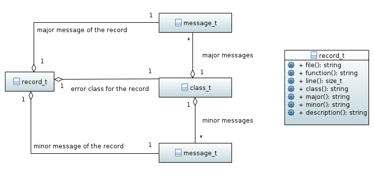
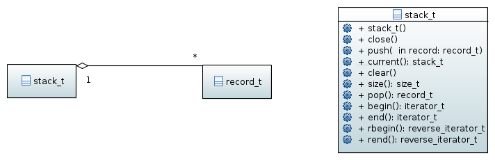

.. _error-namespace:

================================================
Managing errors (namespace :cpp:any:`h5::error`)
================================================

.. warning::

    The content of this page is partially speculative as the HDF5 documentation
    on error management lacks some crucial information.

HDF5 provides a quite versatile error reporting facility. *h5cpp* provides a
thin wrapper around this for situations where users do not want or cannot
use exceptions for error reporting.

Exceptions vs return values
===========================

The default way of reporting errors in C++ are exceptions. As a pure C-library
all error checking in HDF5 is done by return values. Now, which of these
two approaches is favorable depends mostly  on

* personal taste of the developer
* policy of the software to be implemented
* hard technical requirements.

*h5cpp* thus tries to provide an infrastructure which supports both approaches
providing the user with all the flexibility he or she may needs.

The anatomy of an HDF5 error message
====================================

.. todo::

    need to add content here.

The error class :cpp:class:`class_t`
====================================

.. figure:: ../images/error_class_details.png
   :align: center
   :width: 700px

Error classes are basically containers for major- and minor-messages.
Typically an error class is associated with an application or a subsystem
of an application which can be determined from the name of the error class.

.. note::

    It is not yet clear how the interface to create an access major and
    minor messages from a class should be look like.

.. code-block:: cpp

    using namespace h5::error;

    class_t app_errors = class_t::register("MyApp Errors","MyApp","1.0");

    app_errors.major_messages.push_back("Runtime errord");
    app_errors.minor_messages.push_back("Missing argument");

    app_errors.add_major("Runtime error");
    app_errors.add_minor("Missing argument");

    app_errors.get_major(index);
    app_errors.get_minor(index);

.. todo::

    Need to define the interface for major and minor messages.

The error record :cpp:class:`record_t`
======================================

The error stack :cpp:class:`stack_t`
====================================

HDF5 error messages are stored on a stack. Beside the default stack users can
create an arbitrary number of error stacks to which they can push and
pop error messages.

The *h5cpp* error class
======================

*h5cpp* should register its own error class to report errors to the error stack.
