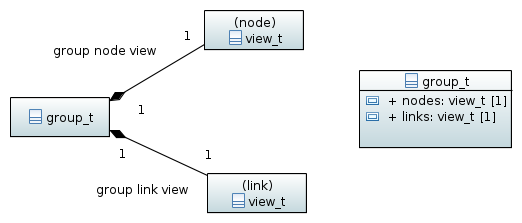

.. _group-namespace:

=======================================
Groups (namespace :cpp:any:`h5::group`)
=======================================

Groups are the only *nodes* in an HDF5 tree which can have child-nodes.

.. _access_child_nodes:

Accessing child nodes and links
===============================

Aside from the :cpp:member:`attributes` member, inherited from 
:cpp:class:`node_t`, :cpp:class:`group_t` provides two more public attributes
which are instances of :cpp:class:`link::view_t` and :cpp:class:`node::view_t`.
The former one provides an STL compliant interface to the links wearing of a 
group wile the latter one provides an STL compliant container interface 
to a groups child nodes. 

Accessing child-nodes
---------------------

The child-nodes of a group can be accessed via the :cpp:member:`group_t::nodes`
attribute. 
There are basically two modes how to access the child nodes

* via their numeric index
* via their path.

In the former case the order in which the nodes appear depends on the selected 
index type and index order (see :ref:`containers-views-iterators` for more 
details about this topic). 

A simple iteration would look like this 

.. code-block:: cpp

    using namespace h5;
    using namespace h5::utilities;

    group::group_t g = ....;
    
    for(size_t index=0;index<g.nodes.size();index++)
    {
        node::node_t  n = g.nodes[index];
        std::cout<<path_t::to_string(n.path())<<std::endl;
    }
    
.. note:: 

    Still have to discuss error handling here. What are we going to do if a 
    the index exceeds the number of children of a group.
    
Using the index of a child nodes provides only access to the direct children 
of a node. If we want to access nodes deeper down the hierarchy we could use 
the path 

.. code-block:: cpp
    
    using namespace h5;
    using namespace h5::utilities;
    
    group::group_t run_0001 = file.root_group().nodes["/run_0001"];
    dataset::dataset_t temp = run_0001.nodes["sensors/temperature"];
    dataset::dataset_t time = run_0001.nodes["time"];
    
    //also absolute paths are valid
    group::group_t run_0002 = run_0001.nodes["/run_0001"];
    
    //we could also use standard file system terminology 
    group::group_run run_0003 = run_0001.nodes["../run_0003"]
    
These functions do not check whether or not the object referenced by the path 
do exist. 

.. note::

    Still need to discuss error handling here. What are we going to do if a 
    path does not exist. 
    
.. note::
    
    From theses code snippets it is clear that we need implicit conversion 
    from a string to a :cpp:class:`path_t` instance. 
    
.. note::

    In the above example we see construction of a :cpp:class:`group_t` and 
    :cpp:class:`dataset_t` from an instance of :cpp:class:`node_t`. 
    We definitely should provide the appropriate constructors
    
    .. code-block:: cpp
    
        class group_t : public node::node_t
        {
            public:
                
                //implicit copy construction from node_t 
                group_t(const node::node_t &node);
                //implicit move construction from node_t
                group_t(node::node_t &&node);
        };
        
    The constructors for :cpp:class:`dataset_t` would look similar. If the 
    conversion is not possible an exception should be thrown!
    
    
Accessing links
---------------

Accessing links works pretty much like accessing child-nodes with two exceptions

* one has to use the :cpp:member:`group_t::links` attribute instead of 
  :cpp:class:`group_t::nodes`
* the return type is already :cpp:class:`link::link_t` - no further conversion 
  is required. 

Links can either be accessed via their numeric index

.. code-block:: cpp

    group::group_t g =...;
    
    for(size_t index=0;index<g.links.size();index++)
    {
        link::link_t l = g.links[index];
        std::cout<<l.name()<<std::endl; 
    }

or via their path

.. code-block:: cpp
    
    using namespace h5;
    using namespace h5::utilities;
    
    group::group_t run_0001 = file.root_group().nodes["/run_0001"];
    link::link_t temp_link = run_0001.links["sensors/temperature"];
    link::link_t time_link = run_0001.nodes["time"];
    
    dataset::dataset_t temp,time; 
    if(temp_link)
    {
        temp = temp_link.resolve()
    }
    else
    {
        //do some error handling here
    }

In particular when using a lot of external links it is sometimes more favorable
to work with links in particular if one can expect that some external resources
do not exist.   

.. note::

    It would also be nice if we would have an implicit conversion from 
    links to node objects. That would require constructors like this 
    
    .. code-block:: cpp
    
        class node_t
        {
            public:
                node_t(const link::link_t &l);
                node_t(link::link_t &&l);
        } 

.. _group-iteration:

Iterators
=========

Iterating over nodes
--------------------

Find all datasets below a particular group 

.. code-block:: cpp

    std::vector<dataset::dataset_t> datasets;
    
    group::group_t g = ....;
    
    std::copy_if(g.nodes.begin_recursive(),g.nodes.end_recursive(),
                 std::back_inserter(datasets),
                 
                 {
                    return n.type() == node_t::type_t::DATASET;
                 });
                
Find groups with a particular attribute set to a specific value

.. code-block:: cpp

    bool is_detector_group(const node::node_t &n)
    {
        if(n.type() != node::node_t::type_t::GROUP) return false; 
        
        if(!n.attributes.exists("NX_class")) return false;
        
        std::string value;
        n.attributes["NX_class"].read(value);
        if(value!="NXdetector") return false;
        
        return true;
    }
    
    std::vector<group::group_t> detectors;
    
    group::group_t entry = file.root_group().nodes["entry"];
    
    std::copy_if(entry.nodes.begin_recursive(),entry.nodes.end_recursive(),
                 std::back_inserter(detectors),
                  { return is_detector_group(n); });

Iterating over links
--------------------

A real world example for link iteration would be a group containing external 
link to datasets. We would like to gather all datasets in a vector but we 
can assume that not all external files (with the datasets) exist. 
This view lines of code would copy only the datasets whose links can be 
resolved. 

.. code-block:: cpp

    std::vector<dataset::dataset_t> frame_blocks; 
    
    std::copy_if(g.links.begin(),g.links.end(),
                 std::back_inserter(frame_blocks),
                  
                 {
                    return l.status() == link::status_t::RESOLVABLE;
                 });

A good example for recursive iteration would be to find all external links 
in a file and check if they can be resolved

.. code-block:: cpp

    std::vector<link::link_t> invalid_ext_links;
    
    group::group_t root_group = file.root_group();
    
    std::copy_if(root_group.links.begin_recursive(),
                 root_group.links.end_recursive(),
                 std::back_inserter(invalid_ext_links),
                  
                 { 
                    return (l.type() == link::link_t::type_t::EXTERNAL) &&
                           (l.status() == link::status_t::NOT_RESOLVABLE);
                 });
                 
     for(const auto &l: invalid_ext_links)
        std::cout<<"Cannot resolve: "<<l.target()<<std::endl;
                 
                 
                 

