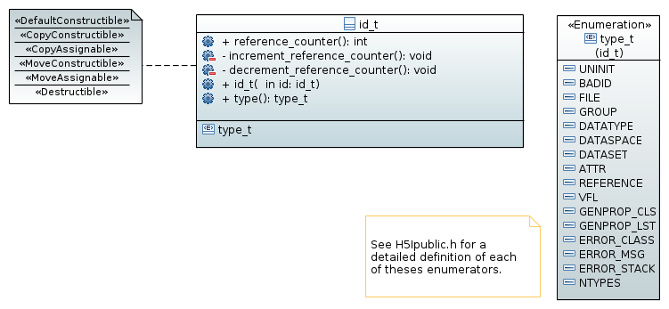

===========================================
ID management (namespace :cpp:any:`h5::id`)
===========================================

In the C-API of HDF5, objects are referenced by IDs, which are returned by
creation or access functions. Theses IDs are a potential source for resource
leaks.
There are two major sources of issues

* the user does not close an object. A typical situation could look like this

    .. code-block:: cpp

        int dosomething(...)
        {
            hid_t group = H5Gopen(...);

            if(error)
            {
                return 1;
            }

            H5Gclose(group);
        }

  If an error occurs the group never gets closed. Consequently the file
  containing the group is never closed properly.
* The user copies IDs around without proper management of their reference
  counters. This can cause parts of the code to deal with invalid IDs.

The C++ wrapper uses a thin guard class :cpp:class:`id_t` around such an
ID which solves all the problems described above.

* it manages the reference counting when an *id* is moved or copied
* it ensures that the *id* is closed whenever it looses scope.

The nested enumeration type :cpp:enum:`id_t::type_t` provides information about
what kind of object is referenced by an instance of :cpp:class:`id_t`.
A possible interface could look like this

.. code-block:: cpp

   class id_t
   {
        private:
            hid_t _id;
            void increment_reference_counter();
            void decrement_reference_counter();
        public:
            // default constructor sets the ID to 0
            id_t();

            // copy constructor - will incremenet the reference counter
            explicit id_t(const id_t &id);

            //move constructor - will not increment the reference counter
            explicit id_t(id_t &&id);

            //ensures that we always take control
            explicit id_t(hid_t &&id);

            //ensures that the ID is properly destroyed when the id looses
            //scope.
            ~id_t();

            //close the ID deliberately
            void close();

            //check for the validity of an ID
            bool is_valid() const;

            //returns the type of the object referenced by this ID
            id_t::type_t type() const;

            // copy assigment - will increment the reference counter
            id_t &operator=(const id_t &id);

            // move assignment - will not increment the reference counter
            id_t &operator=(id_t &&id);

            // get access to the plain ID via static_cast
            explicit hid_t() const noexcept
            {
                return _id;
            }
   };

The fact that the user defined conversion operator is defined as *explicit*
requires us to use :cpp:any:`static_cast` to obtain the ID.

.. code-block:: cpp

    id_t id(H5Tcopy(H5T_NATIVE_DOUBLE));

    //now we want to use the ID
    H5Dcreate(......,static_cast<hid_t>(id),....);

This should make it sufficiently difficult to access the unguarded ID an do
anything harmful with it.

Dealing with invalid IDs
========================

Many C-API functions return a negative ID in case of a failure. As this
is used for error checking :cpp:class:`id_t` should be capable of storing
invalid (negative) ID values.
It is thus neccessary to check for the validity of an ID

.. code-block:: cpp

    class id_t
    {
        public:

            bool is_valid() const noexcept;
    };

As such IDs should still be copy- and moveable we have to check for the
validity of an ID in two situations in the implementation

* when performing updates to the reference counter of an ID
* in the destructor.

In both cases we simply do nothing when the ID stored in the class is not
valid.

Construction of an ID
=====================

Constructing an ID from an plain :cpp:type:`hid_t` value could be done
this way

.. code-block:: cpp

    id_t id(H5Tcopy(H5T_NATIVE_DOUBLE));

or if we want to some error checking in advance

.. code-block:: cpp

    hid_t id_plain = H5Tcopy(H5T_NATIVE_DOUBLE);

    if(id_plain < 0)
    {
        //do some error management here
    }

    id_t id(std::move(id_plain));

There is some design question we need to solve

.. todo::

    To which should the move constructor of :cpp:class:`id_t` perform
    error checking?

Copying and moving
==================

As mentioned earlier, the main purpose of :cpp:class:`id_t` is to manage
reference counting and the lifetime of an ID.
Whether or not the reference counter is incremented depends on how an
ID is copied or constructed.

For the construction we get

.. code-block:: cpp

    id_t id = ....; //create an initial id

    id_t id1(id); //will increment the reference count on the ID
    id_t id2(std::move(id)); //does not increment the reference count

For assignment we get

.. code-block:: cpp

    id_t id = ...; //create an initial id

    id_t id2,id3;

    id2 = id;   //copy assignment - will increment the reference counter
    id3 = std::move(id); //move assigment - will not increment the reference
                         //counter

Usage of IDs in *h5cpp*
======================

As every open object in the C-API, on which *h5cpp* is based upon, is represented
by an ID, :cpp:class:`id_t` is a corner-stone of *h5cpp*.
Virtually every class in *h5cpp* stores an instance of :cpp:class:`id_t` in
order to manage the lifetime of the ID used to acess an object.

.. figure:: ../images/id_composition.png
   :align: center
