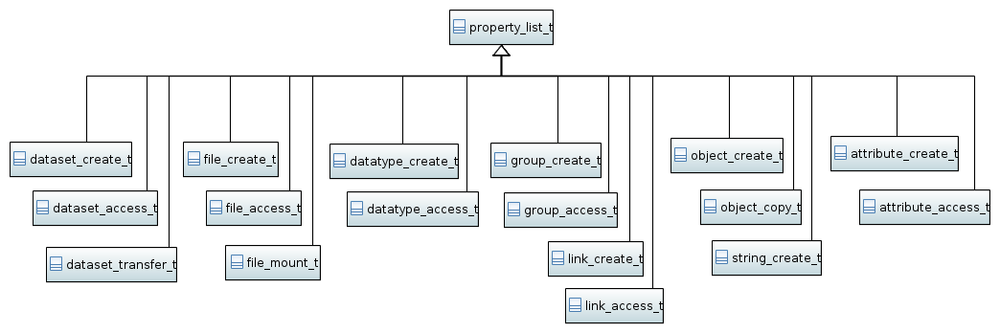

==============
Property lists
==============

Property lists are the basic mechanism to pass arguments to the functions
of the C-API.
One major obstacle of the C interface is that though there is a whole bunch
of different property lists, all of them are represented as the same instance
of :cpp:type:`hid_t` instance. Hence, the compiler cannot check if the correct
property list is passed to as an argument. The C++ wrapper provides an extensive
set of property list types which make type checking at compile time possible.

The base class :cpp:class:`property_list_t` owns the :cpp:type:`id_t` instance
associated with a particular property list. The child classes should
provide convenience  methods to set the parameters of a particular property
list.

To demonstrate the motivation for these property list types consider
the following C function to create a dataset

.. code-block:: c

    hid_t H5Dcreate(hid_t loc_id,
                    const char *name,
                    hid_t dtype_id,
                    hid_t space_id,
                    hid_t lcpl_id,
                    hid_t dcpl_id,
                    hid_t dapl_id)

The last three arguments are the id's to the *link creation property list*,
the *dataset creation property list* and the *dataset access property list*.
A possible wrapper for this function in C++ could look like this

.. code-block:: c++

    id_t create_dataset(const id_t &location,
                        const path_t &path,
                        const datatype::datatype_t &dtype,
                        const dataspace::dataspace_t &dspace,
                        const property_list::link_create_t &lcpl,
                        const property_list::dataset_create_t &dcpl,
                        const property_list::dataset_access_t &dapl)

With this signature it would be possible for the compiler to check the types
of the property lists passed to the function at compile-time instead of
waiting for a runtime error when testing the program.

General requirements
====================

* the base class :cpp:class:`property_list_t` should not be constructible!
* property lists of every type should be *default constructible*
* in case of a default construction the appropriate :cpp:var:`property::kDefault`
  default property list should be constructed.
