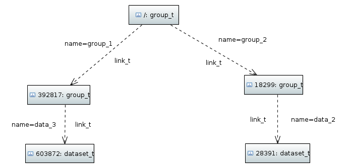
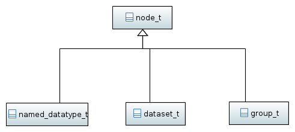
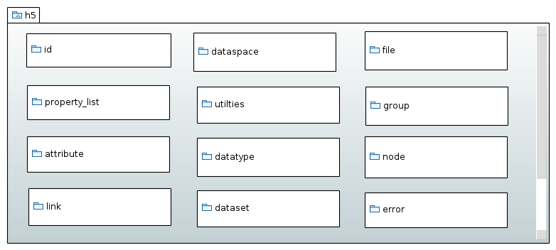

===============
The big picture
===============

The HDF5 tree
=============

HDF5 organizes data within a file as a directed graph consisting of *nodes*
connected via *links*. We can roughly distinguish between to types of nodes:
those who can contain other nodes and those who can not. We will refer to the
former ones as *group* nodes and to the latter ones as *leaf nodes*.

Technically all node types are descendants of :cpp:class:`node_t`

There are currently two types of leaf nodes: :cpp:class:`dataset_t` and
:cpp:class:`named_datatype_t` and one group type :cpp:class:`group_t`.

The links between the nodes are represented by instances of :cpp:class:`link_t`.
We can distinguish between three types of links described by the enueration
type :cpp:enum:`link::type_t`.

+----------------------------------------------+------------------------------+
| link type                                    | description                  |
+==============================================+==============================+
| :cpp:enumerator:`h5::link::type_t::HARD`     | typically the first link     |
|                                              | created when an object is    |
|                                              | created in the file. Every   |
|                                              | object must have a least one |
|                                              | hard link pointing to it.    |
+----------------------------------------------+------------------------------+
| :cpp:enumerator:`h5::link::type_t::SOFT`     | Comparable to a symbolic     |
|                                              | link on a file systems.      |
|                                              | Removing this link does not  |
|                                              | remove an object or makeing  |
|                                              | it inaccessible.             |
+----------------------------------------------+------------------------------+
| :cpp:enumerator:`h5::link::type_t::EXTERNAL` | References an object in a    |
|                                              | different file.              |
+----------------------------------------------+------------------------------+

Aside from *nodes* and *links* there are some more auxiliary types available
which help to construct the tree and feed data into it.

* :cpp:class:`id_t` - wraps an HDF5 :cpp:type:`hid_t` ID used to handle
  objects within the library
* :cpp:class:`datatype_t` - represents an HDF5 data type. Used for IO and
  attribute and dataset creation
* :cpp:class:`property_list_t` and its descendants are used to parametrized
  all kinds of functions in the HDF5 C-API
* :cpp:class:`dataspace_t` - describes the rank and the number of elements
  along each dimension of data in file or memory
* :cpp:class:`file_t` - provides access to file related functions.

There are some more types available which are not mentioned here but these
are the most prominent ones.

The library namespaces
======================

All objects reside in the toplevel namespace :cpp:any:`h5`. There are some
subnamespaces which contain special functions and classes usually not required
for normal operations.

The following namespaces are available

+------------------------------+----------------------------------------+-+
| namespace                    | description                            | |
+==============================+========================================+=+
| :cpp:any:`h5`                | the top-level namespace of the library | |
+------------------------------+----------------------------------------+-+
| :cpp:any:`h5::id`            | classes and functions dealing with ID  | |
|                              | management                             | |
+------------------------------+----------------------------------------+-+
| :cpp:any:`h5::error`         | package providing error management     | |
|                              | related functions and classes.         | |
+------------------------------+----------------------------------------+-+
| :cpp:any:`h5::property_list` | property list classes and related      | |
|                              | functions                              | |
+------------------------------+----------------------------------------+-+
| :cpp:any:`h5::attribute`     | attribute related classes and          | |
|                              | functions                              | |
+------------------------------+----------------------------------------+-+
| :cpp:any:`h5::link`          | classes and functions related to links | |
+------------------------------+----------------------------------------+-+
| :cpp:any:`h5::dataspace`     | classes and functions related to       | |
|                              | HDF5 data spaces                       | |
+------------------------------+----------------------------------------+-+
| :cpp:any:`h5::utilities`     | namespace with general utilty types,   | |
|                              | and functions used throughout the      | |
|                              | the library                            | |
+------------------------------+----------------------------------------+-+
| :cpp:any:`h5::datatype`      | datatype related classes and functions | |
+------------------------------+----------------------------------------+-+
| :cpp:any:`h5::dataset`       | dataset related classes and functions  | |
+------------------------------+----------------------------------------+-+
| :cpp:any:`h5::file`          | file related classes and functions     | |
+------------------------------+----------------------------------------+-+
| :cpp:any:`h5::group`         | group related classes and functions    | |
+------------------------------+----------------------------------------+-+
| :cpp:any:`h5::node`          | classes and functions for general      | |
|                              | node management                        | |
+------------------------------+----------------------------------------+-+

The namespaces mimic in some way the organization of HDF5's C-API.
For the sake of simplicity some of the types are made available to the
top-level namespace :cpp:any:`h5` via aliases.

.. code-block:: cpp

    namespace h5 {

        using path_t      = utilities::path_t;
        using datatype_t  = datatype::datatype_t;
        using dataspace_t = dataspace::dataspace_t;
        using hyperslab_t = dataspace::dataspace_t;
        using dataset_t   = dataset::dataset_t;
        using file_t      = file::file_t;
        using attribute_t = attribute::attribute_t;
        using linkt_t     = link::link_t;
        using node_t      = node::node_t;
        using group_t     = group::group_t;

    } // end of namespace h5

.. _containers-views-iterators:

Containers, views and iterators
===============================

One of the general design goals is to provide an interface as close as possible
to the STL. This would allow users, for instance, to select objects from
an HDF5 tree according to a predefined predicate.
From the above description  it follows that we can treat the node types in HDF5
as STL containers. However, there is a complication. STL containers typically
store data of a homogeneous type. HDF5 node objects are more complex as they
can be viewed as containers whose elements do not only have different types
(nodes, attributes, links) but those types also have different semantics.
An attribute is obviously something different than an other node or a link.

Every node object can be considered an attribute container. But a group
can be considered as a container of

* attributes
* or links
* or other nodes.

To provide a coherent STL compliant view on these different types of objects
views are used on each container. There are currently three view types
available

* :cpp:class:`h5::attribute::view_t` - attribute container view, whose elements
  are of type :cpp:class:`h5::attribute::attribute_t`
* :cpp:class:`h5::node::view_t` - node container view, whose elements are of
  type :cpp:class:`h5::node::node_t`
* :cpp:class:`h5::link::view_t` - link container view, whose elements are of
  type :cpp:class:`h5::link::link_t`.

Each of these views provides an STL compliant container interface to elements
of the appropriate type. However, due to some peculiarities of the HDF5 library
there are certain adjustments we have to make the the standard STL interface.

The first difference with respect to the STL is that HDF5 allows the user
to choose between different index types which determine the ordering of the
elements in the container. In *h5cpp* this index type is represented by the
enumeration type :cpp:enum:`h5::utilties::iter_index_t`.

Secondly the user can pick the direction in which the elements are ordered
according to the selected index type. This includes not only *increasing* and
*reverse* (which would correspond to *forward* and *reverse* iteration in C++),
but also a third ordering named *fastest* which is automatically picked by
the library. The concept of forward and backward iteration thus makes no sense
in the HDF5 world.

It is important to note that these two parameters do not only influence the
behavior of iterators but all situations where an objects is accessed via
a numeric index. Thus :cpp:any:`object[10]` may returns something different
depending on the index type and the ordering direction.

Last but not least HDF5 allows for *direct* and *recursive* iteration. In the
former case the iterator runs only over the direct children of a parent while
in the latter case all subgroups are covered too.

In standard C++ a minimal container interface may looks like this

.. code-block:: cpp

    class container
    {
        public:
            using value_type = ....;
            using iterator = ...;

            size_t size() const;
            value_type operator const;

            iterator begin();
            iterator end();
    };

For our :cpp:class:`view_t` classes we used a slightly different interface
accounting for the special behavior of HDF5.

.. code-block:: cpp

    class view_concept_t
    {
        public:
            using value_type = ...;
            using iterator   = ...;
            using recursive_iterator = ....;

            //get the current index type
            iter_index_t index() const;
            //set the index
            void index(iter_index_t idx);

            //get the current order direction
            iter_dir_t dir() const;
            //set the current order
            void dir(iter_dir_t dir);

            size_t size() const;
            value_type operator const;

            //iterate only over the direct children
            iterator begin();
            iterator end();

            //recursive iteration
            recursive_iterator begin_recursive();
            recursive_iterator end_recursive();
    };

.. note::

    Need to find a solution for range-based algorithms end statements like
    the range-for loop.
