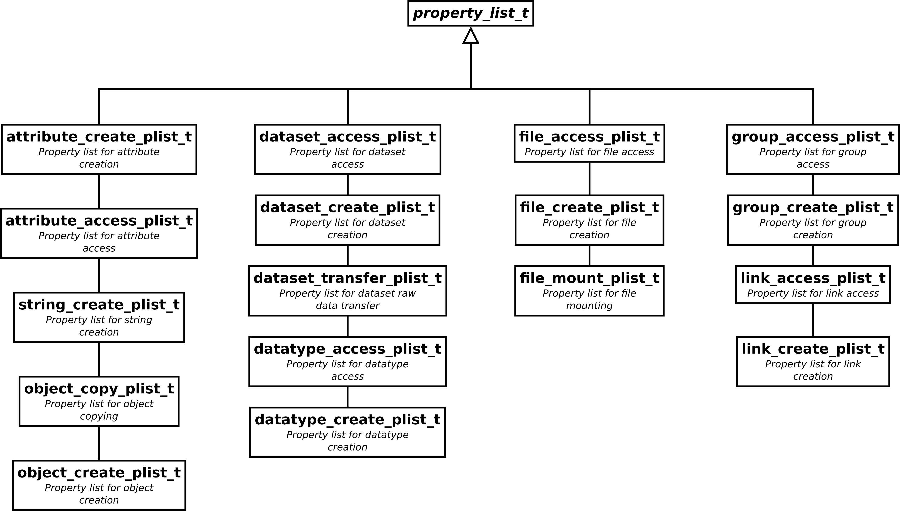

==============
Class diagrams
==============

Basic objects - facing the dangling ID problem
==============================================

.. figure:: ../images/base_classes_uml.png
   :width: 75%
   :align: center

   The :cpp:class:`id_t` type ensures that every every object is closed
   whenever it looses scope. 

A major problem with the C-API for HDF5 is the high risk of resource leakage
due to unclosed objects. Every object opened is reference by an id. If the 
object is not closed it remains open until the program terminates. 
A consequence is that even the file within which the object resides cannot be
closed and reopened again as long as any of the objects within it is
referenced. 

As a soluction the :cpp:class:`id_t` class should act as a kind of guard object
for a raw HDF5 id. It has to major duties

* managing the reference count when an object is moved or copied
* ensure that the ID is destroyed when an object looses scope.

Property lists - compile time checks
====================================

Many functions of the C-API rely on property lists to control their behavior. 
As shown in the figure above there are quite a lot of these property lists 
around. The base class :cpp:class:`property_list_t` provides the basic
interface (for instance to include the ID of the property list instance) while 
the derived types provide 

* methods to set and get properties of the particular list type
* ensure type safety for functions which require a particular type of property 
  list. 

For instance in the C-API the function to create a group has the following
signature: 

.. code-block:: cpp

    hid_t H5Gcreate(hid_t loc_id,const char *name, hid_t lcpl_id, hid_t gcpl_id, hid_t gapl_id)

Where the last three arguments refer to three property lists of type

* link creation property list
* group creation property list
* group access property list.

However, the argument passed is always of type :cpp:type:`hid_t`. Thus, if a
property list of a wrong type is passed this will be recognized only at
runtime. A reasonable replacement for this function in C++ could have 
a signature like this 

.. code-block:: cpp
    
    group_t create_group(const object_t &parent,
                         const string &name,
                         const link_create_plist_t &lcpl,
                         const group_create_plist_t &gcpl,
                         const group_access_plist_t &gapl)

With this approach the correct property list type can be checked at compile 
time and thus eliminate another source of runtime errors which are maybe hard
to find. 
                            

Attribute management
====================

.. figure:: ../images/attribute_manager_uml.png
   :width: 50%
   :align: center

Types that can have attribute (:cpp:class:`group_t` and :cpp:class:`dataset_t`)
have a public attribute of type :cpp:class:`attribute_manager_t` providing an
STL compliant interface to the attached attributes.

Managing selections
===================

.. figure:: ../images/hyperslab_uml.png
   :width: 100%
   :align: center

A selection (hyperslab) is represented by an instance of
:cpp:class:`hyperslab_t`. It provides the same IO functionality as a field or
attribute but, as expected, reads or writes the data to the selection. 

Every instance of :cpp:class:`hyperslab` holds a reference to the dataset it
belongs to. An important implementation detail of :cpp:class:`hyperslab_t` must
be that the selection should only be applied during reading or writing. 
In any case once these operations are finished the selection has to be removed
in order to avoid complications with subsequent selections. 
The selection must also be removed from the dataset when either a read or write
operations fails. A good approach would be something like  a guard object as it
is used for the C++ mutex types in the threading interface.
