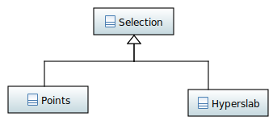

==========
Dataspaces
==========

An important concept in HDF5 are dataspaces. A dataspace describes the layout
of dataelements (which are described by a datatype) on disk as well as 
in memory. In addition dataspaces are used to discribe selections in a
dataset.  

.. figure:: ../images/hdf5_dataspaces.svg
   :align: center
   :width: 75%
   
Currently two of the three dataspaces available in HDF5 are implemented 
in *h5cpp*

* a *scalar* dataspace (:cpp:class:`hdf5::dataspace::Scalar`)
* and a *simple* dataspace (:cpp:class:`hdf5::dataspace::Simple`). 

Dataspaces and related classes can be cound in namespace 
:cpp:any:`hdf5::dataspace`. As shown above all dataspace classes derive from 
a common base class :cpp:class:`hdf5::dataspace::Dataspace` which can be passed 
around whenever a dataspace is needed and the particular type is not relevant. 

Dataspace inquery
=================

The :cpp:class:`hdf5::dataspace::Dataspace` class provides a couple of 
common inquery methods. 

.. cpp::namespace:: hdf5::dataspace

.. cpp:class:: Dataspace

    .. cpp:function:: size_t size()
    
        returns the number of elements which can be stored in a dataspace
        independent of whether a selection has been applied or not. 
        
    .. cpp:function:: Type type() 
    
        returns the type of the dataspace instance 
            
The :cpp:enum:`hdf5::dataspace::Type` identifies the particular type of 
the dataspace there is currently 

.. cpp:enum-class:: Type

    .. cpp:enumerator:: SIMPLE 
    
        for a simple datatype
        
    .. cpp:enumerator:: SCALAR
    
        for a scalar datatype

See :ref:`dataspace-conversion` for a good example of how to use the 
:cpp:func:`Dataspace::type` and the :cpp:enum:`Type` enumeration.

.. _dataspace-scalar:

The scalar dataspace
====================

A scalar dataspace can, as the name already suggests, store a single data 
element. Its construction is thus fairly easy 

.. code-block:: cpp

    namespace hdf5;
    
    dataspace::Scalar space;
    
A valid scalar dataspace can easily instantiated using the default constructor
as there is nothing special to be set. 

.. _dataspace-simple:

The simple dataspace
====================

A simple dataspace can describe a multidimensional array of data elements. 
Such a dataspace has two basic properties 

* the *rank* of the dataspace which is the number of dimensions
* and the *dimensions* which is the number of elements along each dimension. 

In *h5cpp* a simple dataspace can be constructed using the 
:cpp:class:`hdf5::dataspace::Simple` class. There are basically three 
configurations we could use 

* a dataspace of fixed size 
* an extensible dataspace with bounded maximum dimensions
* an extensible dataspace with unbounded maximum dimensions

To create a simple dataspace with fixed dimensions use 

.. code-block:: cpp

    using namespace hdf5;
    
    dataspace::Simple space({2,3}); 
    
    Dimensions current = space.current_dimensions(); // {2,3}
    Dimensions maximum = space.maximum_dimensions(); // {2,3} too
    

    
which will result in a dataspace of rank 2 with 6 elements. To build  an 
extensible dataspace with fixed bounds we could use 

.. code-block:: cpp

    using namespace hdf5;
    
    dataspace::Simple space({2,3},{10,10}); 
    
    space.current_dimensions(); // {2,3}
    space.maximum_dimensions(); // {10,10}
    

    
Finally, for an extensible dataspace with an unlimited number of elements 
along a dimension we could use 

.. code-block:: cpp

    using namespace hdf5;
    
    dataspace::Simple space({1},{dataspace::Simple::UNLIMITED}); 
    

    
The initial size of the dataspace  would be 1. However, we could extend it 
as much as we want (basically can). We will see later how to use this feature
along with datasets. 

A simple dataspace can be completely modified during the lifetime of an 
instance. For instance 

.. code-block:: cpp

    using namespace hdf5;
    
    dataspace::Simple space({3}); // rank=1,size=3
    space.dimensions({2,3},{5,10}); // rank=2,size=6 
    
    

.. _dataspace-conversion: 

Dataspace conversion
====================

For all dataspace classes it is possible to construct a new instance from 
an instance of :cpp:class:`hdf5::dataspace::Dataspace` as they provide a 
special conversion copy constructor 

.. code-block:: cpp

    using namespace hdf5;

    dataspace::Dataspace &general_dataspace = ...;
    dataspace::Simple simple_dataspace(general_dataspace);
    
Using the inquery functions one could for instance use this along with an 
STL container to obtain all simple dataspaces in a collection sdfsdfsf 

.. code-block:: cpp

    using namespace hdf5::dataspace;

    std::vector<Dataspace> all_dataspaces = ...;
    std::vector<Simple> simple_dataspaces; 
    
    std::copy_if(all_dataspaces.begin(),all_dataspaces.end(),
                 std::back_inserter(simple_dataspaces),
                 
                 {
                    return space.type() == Type::SIMPLE;
                 });
                 
Dataspace type trait
====================

When working with user defined types a new type trait to create a dataspace 
must be provided if something else than a scalar dataspace should be 
returned for this type. 

As an example we consider here a trait for a 3x3 matrix type. The C++ class
template for such a class could look like this 

.. code-block:: cpp

    template<typename T> class Matrix
    {
      private:
        std::array<T,9> data_; 
      public:
      
        T *data();
        const T *data() const;
    }; 

Now as a dataspace for such a type we would like to have a simple dataspace 
of shape 3x3 and fixed size. The type trait which must be provided could 
look like this 

.. code-block:: cpp

    #include <h5cpp/hdf5.cpp>
    
    namespace hdf5 {
    namespace dataspace {
    
    
    template<> class TypeTrait<Matrix>
    {
      public:
        using DataspaceType = Simple;
        static DataspaceType create(const Matrix &)
        {
          return Simple({3,3});
        }
    
        static void *ptr(Matrix &value)
        {
          return reinterpret_cast<void*>(value.data());
        }
    
        static const void*cptr(const Matrix &value)
        {
          return reinterpret_cast<const void*>(value.data());
        }
    };
    }
    }
    
Selections
==========

Selections in HDF5 allow the user to read or write only specific data to or 
from a file. This is particularly useful if the total size of a dataset 
is too large to fit into memory or only the specific data is required 
to performa particular action. 

   
HDF5 provides two types of selections 

* *hyperslabs* (:cpp:class:`hdf5::dataspace::Hyperslab`) which are 
  multidimensional selections that maybe can be compared to the complex array 
  slicing and indexing features that numpy arrays allow in Python 
* *point selections* (:cpp:class:`hdf5::dataspace::Points`) which allow picking 
  individual elements from a dataset. 
  
All selections derive from :cpp:class:`hdf5::dataspace::Selection`. This 
class basically provides a single method to apply a selection on a dataspace. 

  
.. attention::

    Currently only hyperslabs are implemented in *h5cpp*.
    
    
Applying a selection
--------------------

In order to apply a selection you can use the :cpp:class:`SelectionManager`
interface provided by a :cpp:class:`Dataspace` via the public member 
:cpp:member:`Dataspace::selection`.

.. figure:: ../images/hdf5_selection_manager.svg
   :align: center
   :width: 75%
   
A selection can be applied like this 

.. code-block:: cpp

   dataspace::Dataspace file_space = dataset.dataspace();
   dataspace::Hyperslab slab(...);
   file_space.selection(dataspace::SelectionOperation::SET,slab);
   
.. important::

   Both, :cpp:class:`Dataspace` and :cpp:class:`SelectionManager` have a 
   :cpp:func:`size` method. However, their return value is rather different. 
   If no selection is applied then both methods return the same value. 
   However, if a selection is applied :cpp:func:`Dataspace::size` still returns
   the total number of elements described by the dataspace while 
   :cpp:func:`SelectionManager::size` returns the number of selected elements. 
   
   .. code-block:: cpp
   
      dataspace::Simple space({1024});
      std::cout<<space.size()<<std::endl;           // would print 1024
      std::cout<<space.selection.size()<<std::endl; // would print 1024
      
      space.selection.none();
      std::cout<<space.size()<<std::endl;           // would print 1024
      std::cout<<space.selection.size()<<std::endl; // would print 0
      
Multiple selections can be applied onto a single dataspace. The way how 
the different selections are combined with each other to form the set of 
selected elements can be controlled by *selection operations* which 
are determined by the :cpp:enum:`SelectionOperation` enumerations.  

Hyperslab selections
--------------------

Hyperslabs allow fairly complex multidimensional selections in a dataspace 
which are characterized by 4 quantities 

* *offset* the starting index of the hyperslab in the selection
* *block* the number of elements along each dimension of the original dataspace 
  in a signle block
* *count* the number of blocks along each dimension
* *stride* the offset between each block. 

Lets have a look on the following example with a original dataspace of shape
(9,10). 

.. figure:: ../images/hyperslab_1.svg
   :align: center
   :width: 65% 
   
The selected elements are denoted by the red rectangles. Such a hyperslab would 
have the following parameters

* *offset* = [1,1]
* *block* = [1,2]
* *count* = [3,3]
* *stride* = [2,1]

To construct such a hyperslab you could use 

.. code-block:: cpp 

    dataspace::Simple space({9,10});
    Dimensions offset{1,1};
    Dimensions block{1,2};
    Dimensions count{3,3};
    Dimensions stride{2,1};
    dataspace::Hyperslab{offset,block,count,stride};
    
For details of how to manipulate or alter an instance of 
:cpp:class:`dataspace::Hyperslab` see the API documentation for details. 

As this is quite some code there are two more additional constructors 
which cover common but quite simplier selection scenarios. 
The first one covers the selection of a single contiguous region of data 
within the dataset. For our above example that could look somehow like this 

.. figure:: ../images/hyperslab_2.svg
   :align: center
   :width: 65%
   
For such a purpose there is a two argument constructor which takes only 
the *offset* and the *block* - everything else is set internally to 1

.. code-block:: cpp

    Dimensions offset{1,1};
    Dimensions block{4,5};
    dataspace::Hypeslab{offset,block};
    
In some applications domains such a selection would be called a 
*region of interest* or *ROI*. 
    
The second selection scenario is a number of blocks of size 1 along each 
dimension separated by a particular stride. 

.. figure:: ../images/hyperslab_3.svg
   :align: center
   :width: 65%
   
The constructor call for such a selection would look like this

.. code-block:: cpp

    Dimensions offset{1,1};
    Dimensions stride{2,3};
    Dimensions count{3,3};
    dataspace::Hyperslab{offset,count,stride};

Point selections
----------------

.. todo:: write this section

