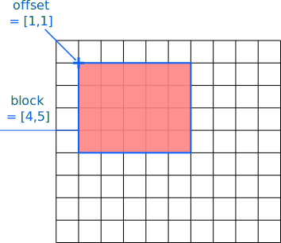
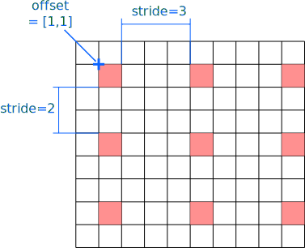

=======================
Working with selections
=======================

Selections in HDF5 allow the user to read or write only specific data to or 
from a file. This is particularly useful if the total size of a dataset 
is too large to fit into memory or only the specific data is required 
to performa particular action. 

.. figure:: ../images/hdf5_selections.svg
   :align: center
   :width: 60%
   
HDF5 provides two types of selections 

* *hyperslabs* (:cpp:class:`hdf5::dataspace::Hyperslab`) which are 
  multidimensional selections that maybe can be compared to the complex array 
  slicing and indexing features that numpy arrays allow in Python 
* *point selections* (:cpp:class:`hdf5::dataspace::Points`) which allow picking 
  individual elements from a dataset. 
  
All selections derive from :cpp:class:`hdf5::dataspace::Selection`. This 
class basically provides a single method to apply a selection on a dataspace. 

  
.. attention::

    Currently only hyperslabs are implemented in *h5cpp*.
    
Furthermore, selections can be combined by means of operators. This allows 
the assembly of rather complex selections from simple ones. It is important to
note here that it is currently not possible to mix :cpp:class:`Points` and 
:cpp:class:`Hyperslab` selections. One reason for this is that each of the 
two classes uses a different set of operators for combination. 

Hyperslab selections
====================

Hyperslabs allow fairly complex multidimensional selections in a dataspace 
which are characterized by 4 quantities 

* *offset* the starting index of the hyperslab in the selection
* *block* the number of elements along each dimension of the original dataspace 
  in a signle block
* *count* the number of blocks along each dimension
* *stride* the offset between each block. 

Lets have a look on the following example with a original dataspace of shape
(9,10). 

.. figure:: ../images/hyperslab_1.svg
   :align: center
   :width: 65% 
   
The selected elements are denoted by the red rectangles. Such a hyperslab would 
have the following parameters

* *offset* = [1,1]
* *block* = [1,2]
* *count* = [3,3]
* *stride* = [2,1]

To construct such a hyperslab you could use 

.. code-block:: cpp 

    dataspace::Simple space({9,10});
    Dimensions offset{1,1};
    Dimensions block{1,2};
    Dimensions count{3,3};
    Dimensions stride{2,1};
    dataspace::Hyperslab{offset,block,count,stride};
    
For details of how to manipulate or alter an instance of 
:cpp:class:`dataspace::Hyperslab` see the API documentation for details. 

As this is quite some code there are two more additional constructors 
which cover common but quite simplier selection scenarios. 
The first one covers the selection of a single contiguous region of data 
within the dataset. For our above example that could look somehow like this 

   
For such a purpose there is a two argument constructor which takes only 
the *offset* and the *block* - everything else is set internally to 1

.. code-block:: cpp

    Dimensions offset{1,1};
    Dimensions block{4,5};
    dataspace::Hypeslab{offset,block};
    
In some applications domains such a selection would be called a 
*region of interest* or *ROI*. 
    
The second selection scenario is a number of blocks of size 1 along each 
dimension separated by a particular stride. 

   
The constructor call for such a selection would look like this

.. code-block:: cpp

    Dimensions offset{1,1};
    Dimensions stride{2,3};
    Dimensions count{3,3};
    dataspace::Hyperslab{offset,count,stride};
    

Point selections
================

.. todo:: write this section

Selection operations and containers
===================================

Point as well as hyperslab selections can be combined by means of different 
logical operations. All available operations for selections are represented 
by the :cpp:enum:`SelectionOperation` enumeration class. 
There are two independent sets of operations available for hyperslab and point
selections. 

For point selections there are two simple operations

+-----------+-----------------------------------------------+--------------------+-+
| operation | enumeration                                   | description        | |
+===========+===============================================+====================+=+
| append    | :cpp:enumerator:`SelectionOperation::APPEND`  | add a point to     | |
|           |                                               | to the end of the  | |
|           |                                               | list of points     | |
+-----------+-----------------------------------------------+--------------------+-+
| prepend   | :cpp:enumerator:`SelectionOperation::PREPEND` | add a point to the | |
|           |                                               | beginning of the   | |
|           |                                               | list of points     | |
+-----------+-----------------------------------------------+--------------------+-+

It is crucial to understand that selection operators combine a new 
selection whith what is already selected in the dataspace. 
For hyperslab selections we have 

+-----------+--------------------------------------------+-----------------------+-+
| operation | enumeration                                | description           | |
+===========+============================================+=======================+=+
| *set*     | :cpp:enumerator:`SelectionOperation::SET`  | replace all previous  | |
|           |                                            | selections with the   | |
|           |                                            | current one.          | |
+-----------+--------------------------------------------+-----------------------+-+
| *or*      | :cpp:enumerator:`SelectionOperation::OR`   | select elements       | |
|           |                                            | which are in the      | |
|           |                                            | current or the        | |
|           |                                            | previous selection.   | |
+-----------+--------------------------------------------+-----------------------+-+
| *and*     | :cpp:enumerator:`SelectionOperation::AND`  | select elements whcih | |
|           |                                            | are in the current    | |
|           |                                            | and the previous      | |
|           |                                            | selection.            | |
+-----------+--------------------------------------------+-----------------------+-+
| *xor*     | :cpp:enumerator:`SelectionOperation::XOR`  | select elements which | |
|           |                                            | are either in the     | |
|           |                                            | current or the        | |
|           |                                            | the previous          | |
|           |                                            | selection but on in   | |
|           |                                            | both.                 | |
+-----------+--------------------------------------------+-----------------------+-+
| *notB*    | :cpp:enumerator:`SelectionOperation::NOTB` | select elements whcih | |
|           |                                            | are in the current    | |
|           |                                            | but not in the        | |
|           |                                            | previous selection.   | |
+-----------+--------------------------------------------+-----------------------+-+
| *notA*    | :cpp:enumerator:`SelectionOperation::NOTA` | select elements which | |
|           |                                            | are in the previous   | |
|           |                                            | but not in the        | |
|           |                                            | current one.          | |
+-----------+--------------------------------------------+-----------------------+-+

.. todo::

   Add here some images showing how these operators work.

Selections can be stored along with their operations in a list for later usage. 
For this purpose *h5cpp* defines three utility types 

* :cpp:type:`Selection::SharedPointer` which is a smart-pointer to a 
  selection
* :cpp:type:`SelectionPair` whose first element is a
  :cpp:enum:`SelectionOperation` enumeration and its second is 
  :cpp:type:`Selection::SharedPointer` refering to the selection of 
  interest
* :cpp:class:`SelectionList` which is an STL list of 
  :cpp:type:`SelectionPair` instances. 
  
.. note::

    As selections use virtual functions to apply themselves to a given 
    dataspace we cannot simply store a value of :cpp:class:`Selection`. 
    We thus need a pointer to reference the particular selection.
    
    However, since we are using a smart pointer we never run into 
    troubles with resouce leaks. 
    
Consider this example 

.. code-block:: cpp

    dataspace::SelectionList selections;
    selections.push_back({dataspace::SelectionOperation::SET,
                          Selection::SharedPointer(new dataspace::Hyperslab({0,0},{100,100}))});
    selections.push_back({dataspace::SelectionOperation::OR,
                          Selection::SharedPointer(new dataspace::Hyperslab({200,129},{100,100}))});
                          
    dataspace::Simple space = ...;
    
    for(auto selection: selections)
        selection.second->apply(space,selection.first);
    
     
    
    
Applying a selection
====================

There are two interfaces which can be used to add a selection to an existing 
dataspace:

* the :cpp:class:`SelectionManager` interface provided by the public 
  :cpp:member:`selection` member of every :cpp:class:`Dataspace` instance
* by means of arithmetic operators. 

Furthermore, we have to distinguish between 

* *modifying* selection application where an existing dataspace is 
  modified 
* and *copying* application where a new dataspace with the selections 
  applied is created from an original one. 

Using the :cpp:class:`SelectionManager` interface
-------------------------------------------------

In order to apply a selection you can use the :cpp:class:`SelectionManager`
interface provided by a :cpp:class:`Dataspace` via the public member 
:cpp:member:`Dataspace::selection`.

   
A selection can be applied like this 

.. code-block:: cpp

   dataspace::Dataspace file_space = dataset.dataspace();
   dataspace::Hyperslab slab(...);
   file_space.selection(dataspace::SelectionOperation::SET,slab);
   
.. important::

   Both, :cpp:class:`Dataspace` and :cpp:class:`SelectionManager` have a 
   :cpp:func:`size` method. However, their return value is rather different. 
   If no selection is applied then both methods return the same value. 
   However, if a selection is applied :cpp:func:`Dataspace::size` still returns
   the total number of elements described by the dataspace while 
   :cpp:func:`SelectionManager::size` returns the number of selected elements. 
   
   .. code-block:: cpp
   
      dataspace::Simple space({1024});
      std::cout<<space.size()<<std::endl;           // would print 1024
      std::cout<<space.selection.size()<<std::endl; // would print 1024
      
      space.selection.none();
      std::cout<<space.size()<<std::endl;           // would print 1024
      std::cout<<space.selection.size()<<std::endl; // would print 0
      
Multiple selections can be applied onto a single dataspace. The way how 
the different selections are combined with each other to form the set of 
selected elements can be controlled by *selection operations* which 
are determined by the :cpp:enum:`SelectionOperation` enumerations.  

Operators
---------

Selections can be applied directly to a dataspace using operators. In this 
case we have to distinguish two cases 

* *modifying* operations where an existing dataspace is modified 
* and *constructing* operations which create a new dataspace. 

Copying usage of operators 

.. code-block:: cpp

    Dataspace::Simple orig_space = ...;
    
    function(orig_space | Hyperslab{{0,0},{100,23}} 
                        | Hyperslab{{200,300},{300,342}});
                        
      

