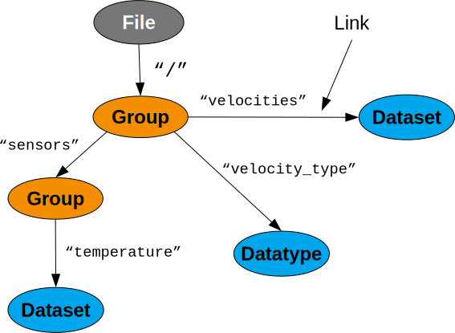

.. _ug-design-overview:

===============
Design overview
===============

.. sectionauthor:: Eugen Wintersberger <eugen.wintersberger@desy.de>

This chapter provides a brief overview over the design of *h5cpp* and the 
underlying assumptins and concepts. It is not a full design documentation 
but will introduce all terms required to read the users guide as well as
to read the API documentation. 
    
       
A high level view on HDF5
=========================

Nodes and Links
---------------

An HDF5 tree can be considered a tree of objects connected by links. 

   
From a very high level point of view we can assume that there are two kind 
of objects 

1. container objects which can store links to other object 
2. leafe like objects which cannot hold links to other objects

There is only one container type, a *Group*. For the leaf type of objects there
are only two: *Datasets* and *commited Datatypes*. We can collect all theses
objects under one master term: a *node*. From that point of view an HDF5 file 
is a tree of nodes connected by links. 

In addition each node can be augumented with attributes which can store 
additional metadata about an objects

.. figure:: ../images/hdf5_attributes.svg
   :align: center
   :width: 50%

Attributes can be accessed via their name. Lets have a closer look on the 
links. 

.. figure:: ../images/hdf5_links.svg
   :align: center
   :width: 75%
   
There are actually three kinds of links connecting objects within a file 

* *hard links* which are created when a new object is created in a file
* *soft links* which can be used liks symbolic links on a file system to 
  provide alternative means of access to an object
* *external links* providing a means to reference objects from a different 
  file.
  
This concept introduces some kind of ambiguity as can be seen from the 
figure above. There are basically three tracks which lead to the same 
*Dataset* instance. This is a known problem in the HDF5 library and *h5cpp* 
has taken a rather pragmatic approach how to solve it as will be shown later. 

Furthermore it is important to note that *Nodes* in an HDF5 file do not have 
names. This is an unfortunate widespread misconception about HDF5. *Nodes* 
can be accessed via a list of links which have names but the *Nodes* 
themeselfes have no idea about a name. Which would not even make sense if 
we take the ambiguity shown above into account. Which of the three link chains
leading to the *Dataset* instance would be the correct name of the *Dataset*?
  

   
Paths
-----

An important concept throughout *h5cpp* is a *Path*. A *Path* is used to 
reference a particular *Node* within an HDF5 file. Essentially it is the 
list of *Link* names used to access an object. 
As we have already seen the path to a *Node* is by no means unique. It is 
possible to access the same *Node* via different paths. 

The string representation of a path looks quite like a Unix filesystem path. 
It is the list of names separated by `/`. In the above example two possible 
paths to the *Dataset* would be 

.. code-block:: text

    /sensors/temp
    /plot/y 
    
Node IDs
--------

In the figure above we have seen that there are many paths that could lead to 
the same object. Now, if we do a recursive traversal over all nodes in a file 
we would face the problem that we get a copy of the same node several times. 
One for each path which leads to this object. 
We thus introduced the concept of a unique ID which is associated with every 
node. This ID identifies an object uniquely even over file boundaries and 
remains constant once a node has been created within a particular file.

.. attention::

    If you are familiar with HDF5s C-API do not confuse the unique ID 
    introduced by *h5cpp* with the :cpp:type:`hid_t` used in the C-API 
    to reference an instance of an object. The latter one is rather a handler 
    than an unqiue ID. IDs in *h5cpp* identify nodes uniquely even over 
    file boundaries at least within the context of a program. 
    While the value of :cpp:type:`hid_t` can change after closing and 
    re-opening the same object *h5cpp*s unique ID remains always the same. 
    
.. important::

    What you should take from this section are 
    
    * an HDF5 file constists of *Nodes* which are  
        - *Groups*
        - *Datasets*
        - *commited Datatypes*
        
    * which are connected via *Links* from which there are three kinds
        - *hard links*
        - *soft links*
        - and *external links*
        
    * nodes can be augumented with *Attributes* which can be used to 
      store additional metadata about a *Node*.
    * *Nodes* do not have names, *Links* have.
    * *Paths* are lists of link names referencing a node within a file
    * every *Node* is associated with a unique ID which remains unique 
      even over file boundaries
      
Data IO
-------

Until now we have only considered structural aspects of an HDF5 file. The 
second and most probably most important topic is data IO. 
To understand how data IO works in HDF5 we first have to introduce a bit 
terminology. 

From a rather high level point of view the smallest unit of information which 
can be accessed by HDF5 is a *data element*. Such a *data element* can be 
everything ranging from a  single integer number up to complex types 
consisting of nested C-structs or C++ classes. A *data element* is stored in 
memory and/or on disk as a set of bits. In order to interpret these bits 
correctly and reassemble the stored *data element* we need some information 
about it. This information is provided in HDF5 by a *datatype*. 

*Data elements* have some logical organization. For instance we can 
store these elements in a 2 dimensional array. 

.. figure:: ../images/dataspace_high_level.svg
   :align: center
   :width: 75%
   
   *data elements* of 3 numbers (could be a 3D vector) are stored in a 
   2 dimensional array with 5 elements along the first and 3 elements 
   along the second dimensions. 

The logical layout of *data elements* is described by a *dataspace*. 
Currently there are only two *dataspaces* available in HDF5

* a *scalar* space which can store only a single element
* and a *simple* space which is a regular n-dimensional array 
  (as the one above).

*Dataspaces* and *datatypes* are the fundamental building blocks of all 
objects that can store data within an HDF5 file

* *attributes*
* and *datasets*

For the construction of either of them you have to provide a *datatype* and 
a *dataspace*. As a matter of fact, *attributes* and *datasets* are quite 
similar, though a *dataset* is a *node* type and can be accessed via a 
*path*. In addition, *datasets* are far more flexible than *attributes* as 
we will see soon. 

We need to introduce the term *storage* as a rather abstract region of space 
where we can store data and which is contiguous and linear addressable. 
Technically such a *storage* can be implemented either 

* in memory (as a contiguous region of memory)
* or on disk

where in the latter case it is not important for us how exactly the data 
is stored on disk (as a single block of data within a file or scattered 
over several blocks within a file).

We never have to care about the :cpp:class:`DiskStorage` this is done by the 
HDF5 library. However, in some cases we need to care about the 
:cpp:class:`MemoryStorage`. As far as it concerns this chapter we can consider
both to satisfiy the above constraints. 

We will have a look now how data transfer roughly works by using the above 
example. For the dataset under consideration we have 

* a datatype comprising 3 double valus (3x8Bytes) and thus a total size of 
  24 Bytes
* and a dataspace of shape (3,5) where the last index varies fastest. 

The :cpp:class:`MemoryStorage` of such a dataset would look like this 

   
Every data element occupies 24Byte. The numbers on the very left denote the 
memory offset in byte for the very left byte in the block. In the above figure
the elements are represented in a 3x5 matrix to preserve space but in memory 
they would be aligend simply one after the other.
It is the dataspace which associates the linear region of memory with a 
particular shape. By default C-style ordering, last index variest fastest, 
is used. As a matter of fact it is the job of the dataspace to map the 
multidimensional index of a particular element onto a linear address in the 
storage area. 

.. todo::

    add a figure here!

When data is written to disk, the content of the :cpp:class:`MemoryStorage` 
is transfered to the :cpp:class:`DiskStorage`. It is important to note that 
the dataspace of the latter one must not be equal to that of the memory storage. 
They must only have equal size (number of data elements). In addition, the 
data elements in memory must be convertable to those associated with the 
file storage. The same is true for the other direction when reading data 
from the disk. 

.. todo::

    add a figure here!

Selections and partial IO
~~~~~~~~~~~~~~~~~~~~~~~~~

One of the nice features of HDF5 is that we do not have to read or write the 
entire data from or to the disk. This is paticularly usefull if the total 
amount of data available in a dataset would not fit in the memory of the 
computer which wants to access the data. 
We can distinguish between 

* *point selections* where individual data elements can be picked in an 
  arbitrary pattern 
* and *hyperslab selections* which are regular multidimensional *slices*. 
  *Hyperslabs* roughly compare to what you can do with array indices and 
  slices on numpy arrays in Python. 
  
With a point selection we could for instance read the elements 
(0,2), (1,3) and (2,0) and store them in a either a new memory storage of 
size 3 (which would be 72Bytes in total) or in a more sophisticated setup
we could map them on points (0),(5) and (11) in a 1D array in memory. 

.. todo:: add a figure here

   

.. important:: 

   The following concepts are important and thus should be kept in mind 
   for further reading
   
   * a *Datatype* describes a single data element (no matter how complex it 
     might be)
   * a *Dataspace* describes how data elemets are layed out in memory
   * all data is store in *Dataspaces* and *Attributes* (the interfaces are 
     quite simliar but attributes have some limitations)
   * *Selections* make it possible to read only a particular part of a 
     *Dataset*

*h5cpp* a C++ wrapper for *HDF5*
================================

Including a single header file is enough to use *h5cpp* in your code 

.. code-block:: cpp

    #include <h5cpp/hdf5.hpp>
    
This will pull in everything you need. The entire library is organized in 
several namespaces with a top level namespace :cpp:any:`hdf5`

   
The most important classes in the top-level namspace might be  
:cpp:class:`hdf5::Dimensions` and :cpp:class:`hdf5::Path`. 
The former one is merely a type alias 

.. code-block:: cpp

    using Dimensions = std::vector<hsize_t>;
    
in order to get rid of the rather nasty 

.. code-block:: cpp

    hsize_t *dims; 
    
which is heavily used throughout the C-API and thus a rather potential source 
for memory leaks. Using :cpp:class:`std::vector` for this thus solves a lot 
of problems and makes life just easy. 

:cpp:class:`Path` as the name already suggests represents an HDF5 path to 
reference a node within a file. We will discuss this class in more detail later.

+----------------------------+------------------------------------------------+ 
| namespace                  | description                                    |
+============================+================================================+
| :cpp:any:`hdf5::property`  | namespace with property list implementations.  |
+----------------------------+------------------------------------------------+
| :cpp:any:`hdf5::attribute` | contains all classes related to attributes and |
|                            | attribute management.                          |
+----------------------------+------------------------------------------------+
| :cpp:any:`hdf5::datatype`  | datatypes and related utility functions. The   |
|                            | classes in this namespace should not be        |
|                            | confused with *commited datatypes* which are   |
|                            | indeed nodes.                                  |
+----------------------------+------------------------------------------------+
| :cpp:any:`hdf5::node`      | the most imporant namespace providing all      |
|                            | functionality to deal with nodes.              |
+----------------------------+------------------------------------------------+
| :cpp:any:`hdf5::dataspace` | dataspaces and related utilities               |
+----------------------------+------------------------------------------------+
| :cpp:any:`hdf5::error`     | error management and exceptions                |
+----------------------------+------------------------------------------------+
| :cpp:any:`hdf5::file`      | everything releated to files                   |
+----------------------------+------------------------------------------------+

Nodes
-----

All classes representing nodes are located in the :cpp:any:`hdf5::node`
namespace. The most prominent ones are 

.. figure:: ../images/hdf5_node_types.svg
   :align: center
   :width: 75%
   
As you can see all node classes have a common parent class 
:cpp:class:`hdf5::node::Node`. 

